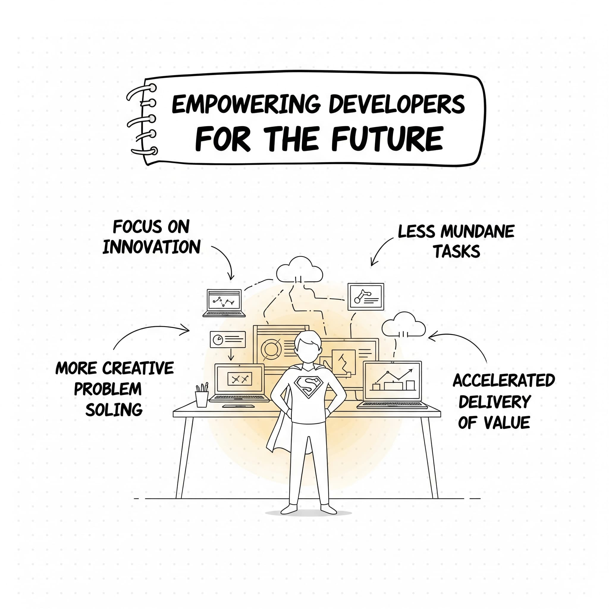

# No More Guessing, No More Grinding: How AI is Revolutionizing DevOps

The relentless pace of technological advancement, coupled with an insatiable market demand for innovative and reliable software, has placed immense pressure on modern software development and operations (DevOps) teams. What began as a movement to foster collaboration and streamline workflows has evolved into a complex ecosystem striving for continuous delivery, unparalleled stability, and optimal efficiency. Developers, at the forefront of creation, are perpetually challenged to push the boundaries of innovation at breakneck speed, while operations teams bear the critical responsibility of ensuring these dynamic systems remain robust, scalable, and secure in increasingly intricate environments. This inherent tension, if not meticulously managed, often culminates in bottlenecks, the proliferation of tedious and repetitive manual tasks, and the omnipresent threat of elusive errors and costly outages.

For years, the foundational tenets of the DevOps movement—automation, seamless collaboration, and a philosophy of continuous improvement—have served as guiding principles. The adoption of powerful tools and practices such as Continuous Integration/Continuous Delivery (CI/CD) pipelines, infrastructure-as-code (IaC), robust monitoring solutions, and comprehensive observability platforms has undeniably transformed and significantly streamlined the software delivery lifecycle. However, even with these profound advancements, the intrinsic complexity of contemporary software systems, often comprising distributed microservices, intricate dependencies, and multi-cloud deployments, coupled with the sheer deluge of operational data generated, can easily overwhelm human capacity. This persistent challenge frequently leads to the very "guesswork and grinding" that the DevOps ethos originally sought to eliminate, leaving teams reactive and prone to burnout.

In this transformative landscape, Artificial Intelligence (AI) emerges not merely as a nascent technology but as a tangible, disruptive force that is fundamentally reshaping diverse industries. Its integration into DevOps is no longer a theoretical exercise but a rapidly materializing reality. By harnessing the formidable capabilities of machine learning (ML), natural language processing (NLP), advanced pattern recognition, and other sophisticated AI techniques, we can inject an unprecedented level of intelligence, adaptability, and foresight into every facet of the DevOps lifecycle. This profound paradigm shift transcends mere rule-based automation, propelling us towards truly smart, self-optimizing, and resilient systems. Such an evolution promises to dramatically alleviate the burden of repetitive manual tasks, furnish profoundly deeper and more actionable insights into system behavior, proactively optimize performance before issues arise, and, most critically, empower developers and operations professionals alike to dedicate their invaluable cognitive resources to what they do best: designing, building, and deploying cutting-edge software that truly solves complex problems.

This comprehensive article will embark on a deep dive into the transformative potential of AI within the DevOps paradigm. We will meticulously explore the critical areas where AI is already making a significant and measurable impact, dissect the technical underpinnings of these advancements, and meticulously outline a compelling vision for a future where "no more guessing, no more grinding" transcends a mere aspirational slogan to become the lived reality of every software development and operations professional.

---

### The Enduring Pains of Traditional DevOps: The "Guesswork and Grinding" Cycle

Before we embark on a detailed exploration of the AI-powered future, it is imperative to conduct an honest appraisal of the inherent limitations and persistent pain points that characterize many traditional DevOps implementations. These are the very inefficiencies, complexities, and human-intensive activities that AI is uniquely positioned to alleviate or entirely resolve.

**1. The Inescapable Burden of Manual Tasks and Toil:**
Despite the fervent embrace of automation, a significant portion of the DevOps lifecycle often remains stubbornly manual and distressingly repetitive. Consider the intricacies of software deployments: even with sophisticated CI/CD pipelines, engineers often find themselves grappling with intricate scripting, meticulous environment configuration, and bespoke release orchestration steps that demand constant human oversight. Similarly, software testing, though increasingly automated, still frequently necessitates manual effort for crafting nuanced test cases, executing complex end-to-end scenarios, and laboriously triaging test results. Beyond these, the daily deluge of monitoring alerts can overwhelm operations teams, leading to a constant state of "alert fatigue" that demands manual triage, investigation, and often, rudimentary, rule-based remediation. These manual processes are not merely time-consuming drains on productivity; they are intrinsically prone to human error—misconfigurations, overlooked details, or simple fatigue—which can cascade into catastrophic consequences, including costly downtime, debilitating performance degradation, and critical security vulnerabilities. The sheer volume of such toil directly inhibits innovation, diverting precious engineering hours from strategic initiatives to mundane upkeep.

**2. The Labyrinthine Complexity of Modern Distributed Systems:**
The architectural evolution towards microservices, the proliferation of cloud-native paradigms, and the widespread adoption of highly distributed systems have collectively introduced an unprecedented, almost dizzying, level of complexity into software ecosystems. Understanding the intricate, dynamic interactions between hundreds or even thousands of microservices, each potentially running in ephemeral containers across multiple cloud providers, is a Herculean task. Diagnosing elusive issues that manifest across disparate services, tracing the root cause through a convoluted chain of events, and accurately predicting potential cascading failures demand an ability to synthesize and analyze vast, heterogeneous datasets in real-time. Human teams, even the most skilled, are inherently limited in their capacity to process, correlate, and derive actionable insights from such monumental volumes of data. This intractable complexity frequently forces teams into a reactive troubleshooting posture, relying on educated guesses, intuition, and laborious manual log inspection rather than systematic, proactive optimization informed by deep, data-driven intelligence.

**3. The Unrelenting Data Deluge and the Scourge of Alert Fatigue:**
Contemporary IT infrastructure and applications are prolific generators of data. Every component, from network devices to application containers, continuously emits a torrent of logs, performance metrics, and distributed traces. While modern observability tools have made significant strides in collecting and visualizing this data, the sheer volume can be overwhelming. Operations teams frequently succumb to "alert fatigue," a state where a constant, undifferentiated stream of notifications—many of which are false positives, informational messages, or low-priority issues—desensitizes them. This desensitization means that truly critical alerts, demanding immediate attention, can be easily overlooked amidst the noise, leading to delayed responses and exacerbated incidents. Manually sifting through this voluminous, often unstructured data to identify meaningful patterns, pinpoint anomalies, and derive actionable insights is a time-consuming, inefficient, and mentally taxing process that diminishes human effectiveness.

**4. The Pernicious Silos of Insights:**
Even in organizations with advanced data collection capabilities, the insights derived from different tools and stages of the DevOps lifecycle often remain stubbornly siloed. For instance, high-fidelity performance monitoring data might be meticulously collected but not easily correlated in real-time with recent code changes, specific infrastructure configurations, or even particular user behavior patterns. This lack of interconnectedness makes it extraordinarily difficult to pinpoint the true root cause of an issue, understand its cascading effects, or optimize the entire system holistically. The absence of a unified, intelligent data fabric means that critical context is lost, prolonging incident resolution and hindering comprehensive system improvement.

**5. The Inherently Reactive Nature of Traditional Operations:**
For many organizations, traditional IT operations fundamentally operate in a reactive mode. The primary modus operandi is to respond to incidents, performance degradations, or security breaches *after* they have occurred and impacted end-users. While robust incident response and disaster recovery protocols are undeniably crucial, a proactive approach—one that anticipates and actively prevents issues *before* they can manifest and cause harm—is demonstrably more desirable and cost-effective. Achieving this highly coveted proactive posture requires the ability to predict potential problems based on historical data, recognize nascent anomalies, and dynamically optimize systems based on evolving trends. These sophisticated capabilities are largely beyond the reach of purely rule-based automation and manual human analysis, necessitating a leap towards intelligent, AI-driven systems.

**6. The Intrinsic Challenges of Scaling Expertise and Knowledge Transfer:**
As software systems grow exponentially in scale and complexity, so too does the breadth and depth of technical expertise required to effectively manage, troubleshoot, and optimize them. Modern DevOps environments demand engineers with deep knowledge across a bewildering array of technologies: programming languages, cloud platforms, container orchestrators, databases, networking protocols, security frameworks, and more. Finding, recruiting, and retaining engineers with such expansive, cross-domain knowledge is a perpetual and significant challenge in a highly competitive talent market. This scarcity of broad expertise can create severe bottlenecks, hinder the adoption of new technologies, and ultimately limit the ability of teams to scale their operations effectively in pace with business demands. AI, by embedding intelligence and best practices into tools, offers a pathway to democratize some of this expertise.

These pervasive challenges collectively underscore an urgent and undeniable need for a new paradigm in DevOps – one that fundamentally leverages the transformative power of AI to inject unparalleled intelligence, sophisticated automation, and truly proactive capabilities into every single stage of the software delivery lifecycle.

---

### AI as the Catalyst: Injecting Intelligence into DevOps

AI, with its diverse array of sophisticated techniques, offers a powerful and unprecedented toolkit to comprehensively address the multifaceted limitations inherent in traditional DevOps practices. It paves the way for a profoundly more efficient, reliable, and developer-centric future, moving beyond the static limitations of rule-based systems to dynamic, learning, and adaptive environments. Here are the pivotal areas where AI is orchestrating a profound and measurable transformation:

**1. Intelligent Automation: Beyond Scripts to Self-Learning Systems**
AI fundamentally elevates automation from predefined scripts to systems capable of learning, adapting, and making autonomous, intelligent decisions without explicit human instruction for every scenario. This is the realm of *hyperautomation*, where AI components augment and elevate traditional automation tools.

* **Smart Code Suggestions and Completion (e.g., GitHub Copilot, TabNine):** These AI-powered pair programmers are revolutionizing the act of coding. By analyzing vast repositories of public code, internal codebases, and the developer's current context (syntax, comments, variable names), AI models (often large language models or LLMs) can provide context-aware code suggestions, complete entire lines or functions, and even generate boilerplate code based on natural language prompts. This significantly accelerates development velocity, reduces the cognitive load on developers, minimizes syntax errors, and allows engineers to focus on higher-level architectural decisions and innovative problem-solving rather than rote code generation. The impact is a substantial boost in developer productivity and code quality.

*Caption: Depicting the frustrations of manual, error-prone traditional DevOps workflows.*

* **Automated Testing with AI (e.g., AI-powered UI test generation, intelligent test selection):** AI is dramatically transforming the testing landscape. Instead of manually crafting every test case, AI can analyze code changes, user behavior data, and historical test failures to automatically generate new, highly effective test cases, even for complex UIs. Furthermore, AI-powered testing tools can perform intelligent test selection, dynamically prioritizing and running only the most impactful tests based on the recent code changes and their potential blast radius. This drastically reduces overall testing time, particularly in large codebases, while simultaneously improving test coverage and effectiveness. AI can also analyze test results, identifying subtle patterns, predicting potential failure points, and even suggesting fixes, moving beyond simple pass/fail outcomes to deep diagnostic insights. Techniques like reinforcement learning can train agents to explore application states and find bugs.

*Caption: Depicting AI-powered solutions for DevOps.*

* **Intelligent Deployment Orchestration (e.g., AIOps-driven release management):** AI can optimize deployment strategies by analyzing a multitude of factors: historical deployment success rates, infrastructure performance metrics, real-time traffic patterns, and even external risk factors. AI-powered deployment tools can automatically determine the optimal time for a deployment (e.g., low traffic hours identified by AI), intelligently orchestrate complex multi-stage deployments across heterogeneous environments, and even perform automated rollback in case of detected anomalies or failures during the rollout. This significantly reduces the inherent risk associated with deployments, minimizes human-induced errors, and dramatically shortens recovery times (MTTR), thereby boosting system reliability and availability.

* **Automated Remediation and Self-Healing Systems:** This is a pinnacle of intelligent automation. AI-powered monitoring systems go beyond mere anomaly detection; they can automatically trigger sophisticated remediation actions based on learned patterns, historical incident data, and predefined policies. This can range from autonomously restarting a failing microservice, isolating a problematic node, or scaling up resources in response to an unexpected surge in load, to even executing complex diagnostic playbooks. Such capabilities dramatically improve system resilience, reduce the need for manual intervention in routine or even novel issues, and free up operations teams from constant firefighting, allowing them to focus on strategic improvements.

**2. Predictive Analytics and Proactive Operations: Anticipating the Future**
AI's unparalleled ability to process and analyze vast, disparate datasets and identify hidden correlations and temporal patterns enables a fundamental shift from reactive incident response to a highly proactive operational posture. This is the core of AIOps.

* **Predictive Failure Detection (e.g., anomaly detection in time-series data):** By continuously analyzing historical logs, performance metrics, infrastructure telemetry, and even change management records, AI algorithms (e.g., using recurrent neural networks or statistical anomaly detection) can learn the normal behavior of systems and identify subtle, nascent indicators of impending failures long before they escalate into user-impacting outages. This foresight allows operations teams to take proactive, preventative steps—such as preemptively replacing a hard drive exhibiting early failure signs, reconfiguring an overloaded service, or patching a vulnerability—thereby averting downtime and enhancing system stability.

*Caption: Visualizing how AI unlocks valuable insights for performance optimization.*

* **Advanced Anomaly Detection and Contextual Root Cause Analysis:** While traditional monitoring uses static thresholds, AI-powered systems dynamically learn the "normal" operational baseline for thousands of metrics and logs. They can then automatically detect deviations from this baseline (anomalies) in real-time, even for previously unseen patterns. Crucially, AI excels at correlating anomalies across disparate data sources (logs, metrics, traces, events, change data). By synthesizing this vast context, AI can rapidly pinpoint the most probable root cause of an incident, cutting down mean-time-to-resolution (MTTR) from hours to minutes, a task that would be impossible for human teams sifting through terabytes of data.

* **Dynamic Capacity Planning and Resource Optimization:** AI can analyze historical resource utilization patterns, traffic seasonality, and application growth trends, predicting future capacity needs with high accuracy based on anticipated business growth and demand fluctuations. This enables operations teams to proactively provision resources (e.g., spin up new cloud instances), optimize cloud spending by identifying underutilized resources, and ensure that systems have sufficient capacity to handle peak loads without unnecessary, costly over-provisioning. Reinforcement learning can even be used to dynamically adjust resource allocation in real-time based on observed performance and cost.

**3. Enhanced Observability and Intelligent Insights: Clarity from Chaos**
AI can transcend raw observability data (logs, metrics, traces) by transforming it into genuinely actionable insights, providing an unprecedented depth of understanding into system behavior, user experience, and business impact.

* **Intelligent Log Analysis and Pattern Recognition:** Manually sifting through massive volumes of unstructured log data (often petabytes in large enterprises) is a Sisyphean task. AI-powered log analysis tools (leveraging NLP, clustering algorithms, and anomaly detection) can automatically identify critical events, group similar log entries, detect novel patterns, and surface important information, significantly reducing noise and highlighting relevant signals. They can even extract structured meaning from unstructured text, turning raw log lines into valuable data points for analysis.

* **Smart Alerting and Sophisticated Noise Reduction:** The bane of operations teams is alert fatigue. AI algorithms can analyze historical alert patterns, correlate alerts from different sources (e.g., a CPU alert and a database connection error occurring simultaneously), and learn to identify true incidents while suppressing false positives or low-priority, benign notifications. This drastically reduces the volume of alerts, allowing operations teams to focus their attention on the most critical, high-impact issues, leading to faster, more effective responses.

* **Personalized Dashboards and Contextual Recommendations:** AI can personalize observability dashboards based on the roles, responsibilities, and specific concerns of individual team members, highlighting the most relevant metrics and insights pertinent to their domain. Furthermore, based on the analyzed data, AI can provide actionable, contextual recommendations, suggesting potential optimizations, diagnostic steps, or even direct remediation actions, essentially acting as an intelligent co-pilot for SREs and operations engineers.

**4. AI-Powered Governance, Security, and Compliance: Fortifying the Gates**
AI's analytical prowess extends beyond performance and availability, playing a crucial role in strengthening the often-overlooked but vital aspects of governance, security, and regulatory compliance within the DevOps lifecycle.

* **Automated Compliance Checks and Policy Enforcement:** AI can be trained on regulatory requirements (e.g., GDPR, HIPAA, PCI DSS) and internal security policies. It can then automatically analyze infrastructure configurations, code changes, and deployment artifacts against these predefined compliance policies, identifying potential violations, misconfigurations, and non-compliant practices *before* they are deployed to production. This ensures continuous adherence to regulatory requirements and internal governance standards, significantly reducing the risk of costly audits and legal ramifications.

* **Advanced Threat Detection and Proactive Vulnerability Management:** AI-powered security tools leverage machine learning to analyze vast streams of network traffic, user behavior, code repositories, and system logs to detect sophisticated security threats and zero-day vulnerabilities that might bypass traditional signature-based detection systems. Machine learning algorithms can learn to identify subtle patterns of malicious activity, anomalous user behavior, or unusual code commits that indicate a potential breach or exploit. This provides early warnings, enabling security teams to proactively investigate and mitigate risks, turning a reactive posture into a proactive defense.

* **Intelligent Access Control and Anomaly-Based Security:** AI can assist in managing and enforcing complex security policies and access controls by analyzing user access patterns and identifying deviations from normal behavior. For instance, if an account typically logs in from a specific region during business hours suddenly attempts access from a different continent at 3 AM, AI can flag this as an anomaly, potentially indicating a compromised account or insider threat, and trigger automated MFA requests or temporary lockouts.

---

### Building the AI-Powered DevOps Future: Essential Considerations and a Strategic Roadmap

While the transformative potential of AI in DevOps is undeniably immense, successfully realizing this vision is not a trivial undertaking. It demands meticulous planning, a strategic approach, and careful consideration of several interconnected factors. Organizations embarking on this journey must navigate technical complexities, foster new skill sets, and cultivate a culture of trust and collaboration.

**1. Data Quality, Volume, and Availability: The Lifeblood of AI:**
The efficacy and reliability of any AI algorithm are fundamentally predicated on the quality, volume, and accessibility of the data it is trained on. In the context of DevOps, this means ensuring that logs, metrics, traces, deployment records, incident reports, code changes, and even test results are collected consistently, are accurate, free from bias, and easily accessible to AI models. Inadequate, inconsistent, or biased data will inevitably lead to inaccurate predictions, unreliable recommendations, and suboptimal automated decisions, ultimately undermining the very benefits AI is meant to provide. Implementing robust data governance strategies, comprehensive data collection pipelines, rigorous data cleansing processes, and standardized data formats (e.g., OpenTelemetry) are foundational prerequisites for any successful AI/AIOps initiative. Organizations must invest in data engineering to build a reliable data fabric.

**2. Model Explainability, Transparency, and Trust (XAI):**
In critical operational scenarios, where AI is making decisions that directly impact system stability, security, or business continuity, it is paramount for human operators to understand *why* an AI model is making a particular decision or recommendation. **Explainable AI (XAI)** techniques are vital here. They aim to provide insights into the reasoning, confidence levels, and input features that drive AI outputs, making the "black box" more transparent. This fosters trust among engineers, enabling them to validate, audit, and, crucially, override AI-driven actions when necessary. Without explainability, engineers may be hesitant to fully trust and adopt AI-driven automation, especially for high-stakes operational tasks, leading to underutilization or outright rejection. Building trust requires transparency, validation, and the ability to intervene.

**3. Seamless Integration and Interoperability with Existing Toolchains:**
The modern DevOps landscape is characterized by a rich and diverse ecosystem of tools. Any new AI-powered solution must seamlessly integrate with existing CI/CD pipelines, monitoring systems, incident management platforms, code repositories, and cloud environments. Relying on open APIs, adhering to standardized data formats, and prioritizing interoperability are essential for avoiding vendor lock-in and creating a cohesive, functional AI-augmented DevOps ecosystem. Attempting to force AI solutions into isolated, siloed environments will inevitably negate many of their potential benefits and create new integration headaches. A modular, API-first approach is key.

**4. Skill Development, Reskilling, and Cross-Functional Collaboration:**
Embracing AI in DevOps fundamentally necessitates a shift in required skill sets and a deepening of inter-team collaboration. This does not imply that every DevOps engineer must immediately become a machine learning expert or a data scientist. However, a foundational understanding of AI/ML concepts, how AI-driven tools operate, how to interpret their outputs, and how to effectively manage AI models in production (MLOps) is becoming increasingly important. Organizations must invest in reskilling existing talent through training programs, workshops, and mentorship. Furthermore, fostering robust collaboration between data science teams, who develop AI models, and DevOps engineers, who deploy and operate them, is crucial for building, deploying, and maintaining effective AI-powered solutions that align with operational realities and business objectives.

**5. Ethical Considerations, Algorithmic Bias, and Governance:**
As with any powerful AI application, it is imperative to deeply consider the ethical implications and potential for algorithmic bias in AI-powered DevOps tools. For instance, if an AI model tasked with optimizing resource allocation or predicting job success is inadvertently trained on historical data that reflects past biases (e.g., favoring certain hardware configurations that were more prevalent in successful but perhaps older deployments, or optimizing for specific resource types that were historically managed by a particular demographic), it could perpetuate or even amplify those biases. This could lead to unfair resource distribution, suboptimal performance for certain workloads, or even unintended security vulnerabilities. Ensuring fairness, transparency, and accountability in AI algorithms is essential to avoid unintended negative consequences. This requires robust data auditing, bias detection frameworks, human-in-the-loop validation, and clear governance policies for AI deployment and operation.

**6. A Phased, Iterative Approach and a Culture of Continuous Learning:**
Adopting AI in DevOps is not a "big bang" or overnight transformation. Organizations should embrace a phased, iterative approach, starting with specific, well-defined use cases that offer high potential value and are relatively easier to implement. Examples include intelligent log analysis for a critical application, predictive anomaly detection for core infrastructure, or AI-assisted code review for a specific codebase. Based on the results of these initial implementations, teams can learn from successes and failures, refine their strategies, and gradually expand AI's footprint across more complex areas of the DevOps lifecycle. A culture of continuous learning, experimentation, and adaptation is crucial, as both AI technologies and DevOps practices themselves are evolving at a rapid pace. This iterative approach allows for risk mitigation and value realization along the journey.

---

### Conclusion: Embracing the Intelligent Future of DevOps

The era of "guessing and grinding" in software development and operations is rapidly drawing to a close. Artificial Intelligence is poised to be a fundamental game-changer, offering the unprecedented potential to move beyond the inherent limitations of traditional automation and usher in an era of truly intelligent, adaptive, and self-optimizing software delivery systems. By strategically leveraging AI for sophisticated intelligent automation, precise predictive analytics, dramatically enhanced observability and insights, and robust AI-powered governance and security, organizations can systematically dismantle the legacy of toil that has historically plagued DevOps teams. This transformation will ultimately empower developers and operations professionals to redirect their energies towards higher-value activities: fostering innovation, solving complex problems creatively, and delivering exceptional value to end-users with unparalleled speed and reliability.

The journey towards an AI-powered DevOps future is indeed transformative, but it is also one that demands a meticulous strategic approach, an unwavering commitment to data quality and ethical AI practices, a continuous investment in skill development, and, most importantly, a collaborative mindset that spans the traditional boundaries between development, operations, and data science teams. However, the immense potential rewards – including dramatic increases in operational efficiency, profoundly improved system reliability, truly proactive incident prevention, a more secure software supply chain, and ultimately, a superior experience for both the engineers building the software and the users consuming it – make this strategic transformation not merely an option, but an imperative for organizations striving to thrive and lead in the increasingly competitive and complex digital age. By consciously and strategically embracing the formidable power of AI, we can collectively build a future where software development and operations are defined not just by speed and stability, but by intelligence, profound insight, and true developer empowerment.

*Caption: Envisioning a future where AI empowers developers for greater innovation.*
